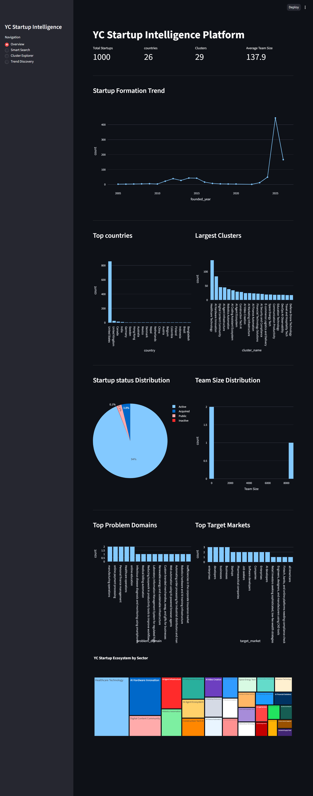
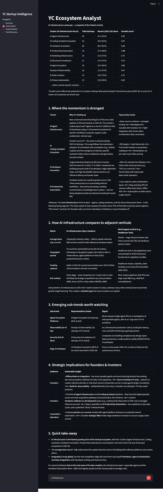
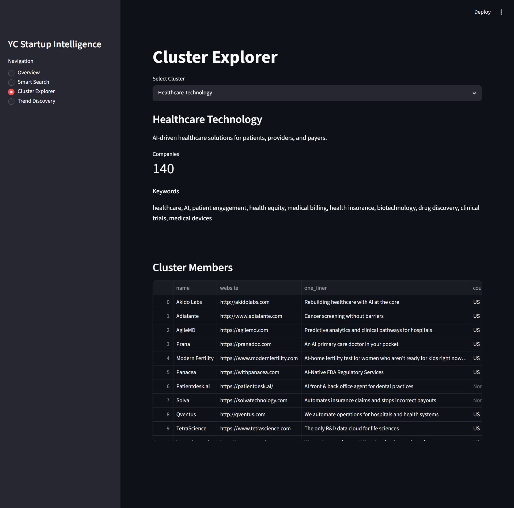
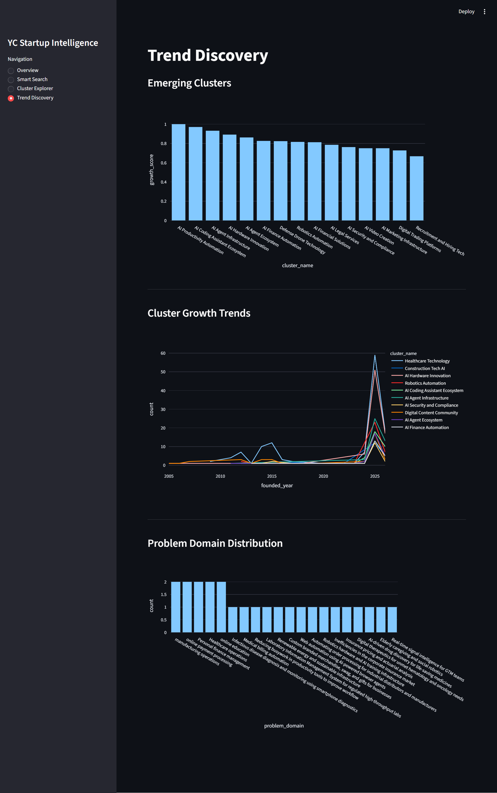

# Startup Intellisense

> A semantic search and analysis platform for Y Combinator startups built with vector embeddings, LLM-powered classification, and interactive clustering.

## Screenshots & Demo

### Application Interface




### Data Pipeline Execution
.png)
.png)
.png)
.png)

## About

Startup Intellisense combines web scraping, semantic search, and unsupervised learning to build an intelligent exploration tool for the Y Combinator startup ecosystem. The platform scrapes YC company data using browser automation, generates dense vector embeddings, and exposes advanced search and discovery capabilities through an interactive dashboard.

This is a full-stack data pipeline: it handles data collection from ycombirator.com, enriches company records with semantic context, builds a queryable vector database, and serves insights through a web interface.

## Interesting Techniques

- **Semantic Search with [Vector Embeddings](https://platform.openai.com/docs/guides/embeddings)** — Uses [SentenceTransformers](https://sbert.net/) (BAAI/bge-base-en-v1.5) to convert startup descriptions into dense vectors, enabling meaning-based search rather than keyword matching.

- **[Cross-Encoding Re-ranking](https://www.sbert.net/docs/usage/semantic_search/)** — Retrieved results are re-ranked using a specialized cross-encoder model (BAAI/bge-reranker-base) to refine search quality beyond initial dense retrieval.

- **Dynamic Query Routing with LLM Classification** — Classifies user queries into intents (company search, trend analysis, cluster analysis, country analysis) and routes to appropriate analysis pipelines using the Groq LLM.

- **Unsupervised Clustering with [HDBSCAN](https://hdbscan.readthedocs.io/)** — Groups startups by density-based clustering on embedding space to discover natural market segments without predefined categories.

- **Dimensionality Reduction for Visualization with [UMAP](https://umap-learn.readthedocs.io/)** — Reduces high-dimensional embeddings (384-dim) to 2D for interactive scatter plots while preserving neighborhood structure.

- **Browser Automation with [Playwright](https://playwright.dev/)** — Programmatically scrolls through dynamic YC company listings to exhaustively collect startup URLs before deep-diving into data enrichment.

- **Asynchronous Database Operations with [asyncpg](https://magicstack.github.io/asyncpg/)** — Uses Python's native `async`/`await` with asyncpg for non-blocking PostgreSQL queries, enabling parallel batch processing of company records.

- **Automatic Retry Logic with [Tenacity](https://tenacity.readthedocs.io/)** — Handles transient failures during scraping and API calls with configurable retry strategies and exponential backoff.

## Key Technologies & Libraries

- **[Qdrant](https://qdrant.tech/)** — Vector database for storing and querying 384-dimensional startup embeddings with metadata filtering and hybrid search.

- **[Groq](https://console.groq.com/)** — Fast inference LLM API used for query classification, trend synthesis, and multi-turn analysis. Significantly faster than standard LLM endpoints.

- **[SentenceTransformers](https://www.sbert.net/)** — Pre-trained transformer models (BAAI BGE series) for generating task-specific embeddings without fine-tuning.

- **[Streamlit](https://streamlit.io/)** — Rapid dashboard framework for building data apps in pure Python without frontend code. Includes built-in caching and reactive state management.

- **[HDBSCAN](https://hdbscan.readthedocs.io/)** — Hierarchical density-based clustering that doesn't require specifying cluster count, ideal for exploratory market analysis.

- **[UMAP](https://umap-learn.readthedocs.io/)** — Efficient manifold learning for high-to-low dimensional projection, often better at preserving global structure than t-SNE.

- **[Plotly](https://plotly.com/python/)** — Interactive visualization library used for scatter plots, trend charts, and geographic maps.

- **[asyncpg](https://magicstack.github.io/asyncpg/)** — Efficient async PostgreSQL driver. About 10x faster than psycopg for bulk operations due to binary protocol and reduced serialization overhead.

- **[pycountry](https://pypi.org/project/pycountry/)** — Provides ISO country/currency codes and names for geographic filtering and standardization.

## Project Structure

```
.
├── Analytics/              # LLM-powered reasoning and search
│   ├── agent.py           # Query router and orchestrator
│   ├── llm_service.py     # Groq API interactions
│   ├── semantic_search.py # Vector DB querying and re-ranking
│   ├── context_builders.py # Multi-source data aggregation
│   └── analytics_tools.py
├── Embed/                 # Embedding pipeline
│   ├── embeddings.py      # SentenceTransformer integration
│   ├── qdrant_service.py  # Vector DB management
│   ├── text_builder.py    # Company description preprocessing
│   └── intoQdrant.py      # Batch embedding uploads
├── Cluster/               # Unsupervised learning
│   ├── cluster_startups.py # HDBSCAN + UMAP analysis
│   └── name_clusters.py   # LLM-generated cluster labels
├── Extract/               # Data enrichment
│   └── enrich_companies.py # Groq-powered company classification
├── Scrape/                # Web collection
│   ├── Scrape_Store.py    # Playwright-based scraper
│   └── PostgreSchema.py   # ORM-like database helpers
├── ui/                    # Frontend components (if any)
├── streamlit_app.py       # Main dashboard entry point
├── app_services.py        # Async service layer
└── pyproject.toml         # Dependencies & project metadata
```

**Key directories:**
- **Analytics/** houses the multi-step query processing pipeline, from LLM-based intent classification to context building and answer synthesis.
- **Embed/** handles the vector embedding workflow: converting company data to embeddings and storing them in Qdrant with full metadata indexing.
- **Cluster/** performs unsupervised market segmentation using density-based clustering and dimensionality reduction for visualization.
- **Scrape/** manages exhaustive YC company data collection via browser automation and stores records in PostgreSQL.

## Tech Stack Summary

| Component | Technology |
|-----------|-----------|
| Data Store | PostgreSQL + Qdrant Vector DB |
| Scraping | Playwright + asyncio |
| Embeddings | SentenceTransformers (BAAI BGE) |
| LLM | Groq (fast inference) |
| Clustering | HDBSCAN + UMAP |
| Dashboard | Streamlit |
| Search | Dense retrieval + Cross-encoder re-ranking |
| Async Runtime | asyncpg + asyncio |

